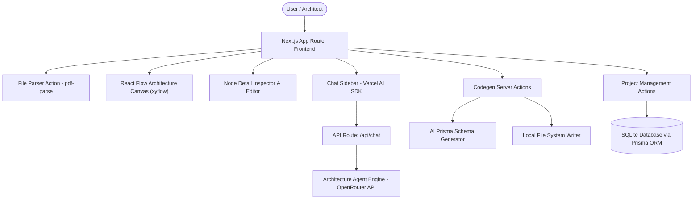

# Technical Architecture (ARCHITECTURE.md) - Agentic Architect

This document defines the system structure, data flow, agent engine, and module responsibilities for **Agentic Architect**.

---

## 1. System Architecture

---

## 2. Directory Responsibilities

| Directory / File | Description & Purpose |
| :--- | :--- |
| `src/agents/architecture-agent.ts` | Autonomous AI prompt generation, system breakdown, node description auto-populator, fallback generator |
| `src/app/actions/codegen.ts` | AI Schema synthesis and direct filesystem persistence to `{targetPath}/prisma/schema.prisma` |
| `src/app/actions/file-parser.ts` | Multi-format spec document parsing (`pdf-parse` integration) |
| `src/app/actions/project.ts` | CRUD operations for persistent SQLite projects (`Project` entity) |
| `src/app/api/chat/route.ts` | Vercel AI SDK Co-Pilot stream endpoint backed by OpenRouter LLMs |
| `src/components/architecture-canvas.tsx` | Visual diagram canvas built on `@xyflow/react`, tier auto-layout calculation, animated edge signals |
| `src/components/playground-workspace.tsx` | Main interactive state orchestrator (Canvas + Inspector + Chat Sidebar + Schema Generator) |
| `src/components/node-inspector.tsx` | Slide-over inspector for node titles, tags, AI descriptions, and single-node AI audits |
| `src/components/idea-input-form.tsx` | Entry point form for prompts & document dropzone |
| `src/components/code-viewer.tsx` | Code display component with syntax highlighting and one-click copy |
| `src/lib/prisma.ts` | Prisma client instantiation with libSQL SQLite adapter support |
| `prisma/schema.prisma` | Application metadata storage schema |

---

## 3. Data & State Flow

1. **Input Phase**: User enters prompt or drops a spec file (`.pdf`, `.txt`, `.md`). `file-parser.ts` extracts raw text.
2. **Architecture Generation**: `architecture-agent.ts` parses requirements into structured JSON containing nodes (Client, API Gateway, Service, Database) and connecting directional edges.
3. **Canvas Visualization**: `@xyflow/react` computes node positions across 4 horizontal layout tiers.
4. **Node Editing & Audit**: User modifies node state or invokes AI node audits; state syncs immediately across canvas and inspector.
5. **Schema Synthesis**: `codegen.ts` converts full node/edge architecture graph into a Prisma SQLite database schema.
6. **Disk Persistence**: User specifies local `targetPath` and clicks write; `codegen.ts` writes directly to disk.

---

## 4. Key Security & Quality Guidelines

1. **Environment Security**: Keep `OPENROUTER_API_KEY` server-side in `.env.local` (ensure `.env` with actual keys is not committed to public VCS).
2. **Path Sanitization**: Validate all `targetPath` arguments in `codegen.ts` to prevent path traversal attacks.
3. **Strict Validation**: Use Zod schemas for all client payload validation in Server Actions and API endpoints.
