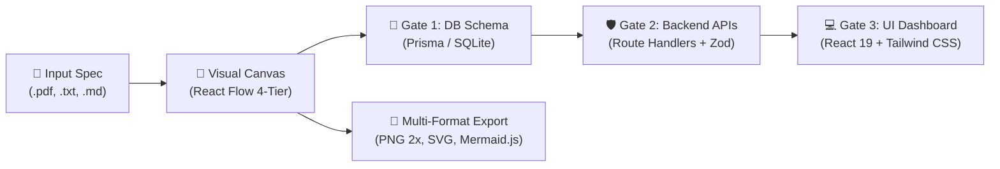

# 🧠 Agentic Architect

**An AI-driven fullstack development platform that translates business requirements and specifications into interactive visual architecture diagrams, production-ready code, and automated quality assurance.**

---

## 🚀 Overview

Agentic Architect is a platform designed for technical founders, software architects, and non-AI engineers to iterate on system designs interactively. It bridges the gap between high-level business requirements (or uploaded specification documents) and technical implementation by combining human oversight with autonomous AI agents.

### 🌐 Bilingual Design Convention
- **Finnish User Experience**: The application frontend, playground workspace, confirmation dialogs, and interactive scorecard modals are crafted in fluent **Finnish** for an intuitive, human-centered developer experience.
- **English Engineering Standards**: All AI-generated code (Prisma schemas, Next.js API route handlers, React 19 UI components), architecture exports (Mermaid diagrams), test suites, and documentation are strictly in **Standard English** for global compatibility, production readiness, and seamless Git collaboration.



Users can input a project description or upload specification files (`.pdf`, `.txt`, `.md`). The system generates an interactive **Visual Architecture Canvas** (using React Flow) representing UI components, APIs, backend services, and database layers. The user and AI Co-Pilot work together in a real-time **Playground** workspace with staged quality gates:
1. **Visual Canvas**: Interactive 4-tier system modeling and AI audits.
2. **Data Gate 1**: Automated Prisma database schema generation (`schema.prisma`).
3. **Data Gate 2**: Automated Next.js App Router Route Handlers (`route.ts`) and Server Actions with Zod validation.
4. **Data Gate 3**: Automated React 19 + Tailwind CSS feature UI components (`dashboard.tsx`) with reactive state.
5. **Diagram Export Suite**: 1-click PNG (2x retina), SVG vector, and Mermaid.js markdown export.
6. **Quality & Security Suite**: 1-click OWASP Security Audits, Code Optimization, and interactive scorecard reporting.
7. **Smart Tech Stack & .env Inference**: Intelligent complexity detection (Lightweight vs. Standard vs. Heavy SaaS) and automated `.env.local.example` guidance.
8. **Next.js 16.3.5 Security Hardened**: Comprehensive HTTP security headers (CSP, X-Frame-Options, HSTS, Permissions-Policy) and strict path containment guards.
9. **Modular Workspace Subcomponents**: Clean separation of Data Gate interfaces (`Gate1SchemaTab`, `Gate2ApiTab`, `Gate3UiTab`, `HomebasePathCard`) under `src/components/workspace/` for optimal maintainability.

---

## ✨ Key Features & Current Status

### 1. 🧪 Interactive Playground Workspace & Node Inspector
- **Text & Document Parsing (.pdf, .txt, .md)**: Input a freeform description or upload a specification document. The server automatically parses content with native `pdf-parse` v2 support.
- **Visual Architecture Canvas**: 4-tiered structured React Flow diagram (Client → Gateway → Services → Database) with automatic layout positioning to prevent node overlap and animated signal pulse edge flows.
- **Node Detail Inspector**: Click any node on the canvas to inspect, rename, edit technology tags, or view AI-generated descriptions in real time.
- **Mandatory AI Node Descriptions**: AI automatically generates comprehensive descriptions for every node, pre-populating the Node Inspector.
- **Real-Time AI Co-Pilot & Smart Fallback Engine**: Conversational interface powered by Vercel AI SDK + OpenRouter API, backed by an intelligent prompt-based fallback engine that ensures customized architecture diagrams are generated even under third-party API rate limits.

### 2. 🛡️ Quality Suite: Security Check & Code Optimization
- **1-Click Security Audit (`app-security`)**: Inspects the entire architecture, database schema, and API routes against OWASP Top 10 guidelines (authentication, Zod schema validation, database connection isolation, secret management).
- **1-Click Code Optimization (`app-perf` / `app-review`)**: Analyzes database indexing (`@@index`), N+1 query risks, structural error handling, and Next.js caching strategies.
- **Visual Audit Scorecard Modal**: Displays an overall health score (0-100), letter grade (A-F), filtered finding cards (Critical, Warning, Success), and actionable recommendations in plain language.
- **Copy Report**: Easily copy the full audit report to the clipboard for documentation or sharing.

### 3. 🧠 Smart Tech Stack Inference & .env Guidance
- **Lean Architecture Sizing**: Automatically classifies projects into:
  - **🟢 Lightweight (Client-side)**: Calculators, games, converters, landing pages. Informs the user that no server database or external API keys are needed!
  - **🟡 Standard Fullstack**: Todo apps, blogs, internal tools. Recommends zero-config SQLite (`file:./dev.db`).
  - **🟣 Heavy SaaS & AI (Enterprise)**: Subscriptions, payments, AI, emails. Recommends PostgreSQL / Supabase, Redis, and guides external service setup.
- **Automated `.env.local.example` Generator**: Produces a ready-to-use commented template with sample values and direct instructions on where to acquire necessary API keys (Stripe, Resend, OpenRouter).
- **One-Click Disk Writer**: Write `.env.local.example` directly to the project folder with safety checks.

### 4. 🛑 Safety First: "Oletko varma?" Confirmation Gates
- **Accidental Click Prevention**: Heavy actions (re-generating code, running audits, writing files to disk) require explicit confirmation via `ConfirmActionDialog`.
- **Transparent Consequences**: The confirmation modal clearly explains what will happen, ensuring users never accidentally overwrite work.

### 5. 🗄️ Data Gate 1: Prisma Database Schema Generation
- **AI Prisma Schema Generator**: Seamlessly transition from visual architecture diagrams to the first quality gate where AI designs production-ready Prisma database schemas (`schema.prisma`) in standard English.
- **Smart Database Advice**: For lightweight tools, Gate 1 displays an encouraging notice explaining that local state or LocalStorage suffices, saving unnecessary complexity.
- **Direct Filesystem Persistence**: Write generated database schemas directly to `{targetPath}/prisma/schema.prisma` with a single click and strict path traversal bounds validation.

### 6. ⚡ Data Gate 2: Backend API Routes & Server Actions
- **AI Backend Code Generator**: Translates Layer 1 (API / Gateway / Auth) and Layer 2 (Services / Workers) into production-ready Next.js App Router Route Handlers (`GET` and `POST`) and Server Actions.
- **Strict Zod Input Validation**: Every mutation endpoint and action is typed and guarded by Zod validation schemas.
- **Uniform Response Envelopes**: Consistent API response contract: `ApiResponse<T>` (`{ success: true, data }` or `{ success: false, error: { code, message, details } }`).
- **One-Click Local Disk Writer**: Safely write generated API code directly to `{targetPath}/src/app/api/endpoints/route.ts`.

### 7. 🎨 Data Gate 3: UI Components & Feature Views
- **AI React 19 UI Component Generator**: Generates complete, self-contained, copy-pasteable React 19 + Tailwind CSS feature dashboards (`dashboard.tsx`) matching the architecture and data models.
- **Interactive State & Metrics**: Features live metric scorecards (total records, active, completed, throughput rate), search bar, status tabs, creation form modals, and interactive item cards.
- **One-Click Local Disk Writer**: Safely write generated UI code directly to `{targetPath}/src/components/features/dashboard.tsx` with safety confirmation guards.

### 8. 📐 Multi-Format Canvas Diagram Export Suite
- **Mermaid.js Flowchart Generator**: Converts React Flow canvas nodes into standard `flowchart TD` markdown partitioned into 4 architectural subgraphs (Client, Gateway, Services, Data) with sanitized labels and custom CSS styling.
- **One-Click Copy & Download**: Copy Mermaid markdown to clipboard or download as `.mmd` or `.md` files for GitHub README, Notion, or Obsidian.
- **Retina PNG & Vector SVG Export**: High-resolution 2x retina raster image and scalable vector graphics download via `html-to-image`.

### 9. 🧪 Automated Testing & Security (Vitest + jsdom)
- **Comprehensive Test Suite**: 34 automated unit and integration tests passing with 0 failures across 9 test suites (`npm test`).
- **Security & Path Bounds Verification**: Intercepts directory traversal attacks (`../../etc/passwd`, `..\..\windows\...`) to protect filesystem writes.
- **Isolated Secrets**: API keys isolated in `.env.local`, with clean `.env.example` templates committed.

---

## 📁 Project Structure

```
├── src/
│   ├── agents/                   # AI Agent engines (architecture-agent.ts)
│   ├── app/                      # Next.js App Router pages & Server Actions
│   │   ├── actions/              # Server Actions (audit.ts, codegen.ts, file-parser.ts, project.ts, tech-stack.ts)
│   │   ├── api/chat/             # Vercel AI SDK Co-Pilot API route (streaming)
│   │   ├── playground/           # Interactive Playground page (Canvas, Gate 1, Gate 2, Gate 3)
│   │   └── projects/[id]/        # Saved project detail view
│   ├── components/               # UI components
│   │   ├── architecture-canvas.tsx   # React Flow visual canvas
│   │   ├── audit-modal.tsx           # Quality & Security scorecard modal
│   │   ├── chat-sidebar.tsx          # AI Co-Pilot chat interface
│   │   ├── code-viewer.tsx           # Syntax-highlighted code viewer & copy tool
│   │   ├── confirm-action-dialog.tsx # "Oletko varma?" confirmation gate
│   │   ├── delete-project-button.tsx # Project deletion button with confirmation
│   │   ├── env-dialog.tsx            # Tech stack & .env.local.example modal
│   │   ├── export-modal.tsx          # Multi-format export dialog (PNG, SVG, Mermaid.js)
│   │   ├── idea-input-form.tsx       # Homepage input form & file dropzone
│   │   ├── node-inspector.tsx        # Node Detail Inspector & manual editor
│   │   ├── playground-workspace.tsx  # Main Playground workspace container
│   │   └── workspace/                # Modular Data Gate & Homebase subcomponents
│   │       ├── homebase-path-card.tsx    # Project homebase directory setting card
│   │       ├── gate1-schema-tab.tsx      # Data Gate 1 Prisma DB schema generator view
│   │       ├── gate2-api-tab.tsx         # Data Gate 2 Next.js API route handlers generator view
│   │       └── gate3-ui-tab.tsx          # Data Gate 3 React 19 UI component generator view
│   └── lib/                      # Prisma DB client, mermaid-export.ts & utilities
├── tests/                        # Vitest automated unit & integration test suite
│   ├── setup.ts                  # Global test setup (Next.js mocks, jsdom)
│   └── unit/                     # 9 Unit test suites (security, parser, agent, codegen, ui, mermaid, audits, tech-stack)
├── prisma/                       # Prisma SQLite schema & migrations
├── docs/                         # Project vision documentation
├── .agents/                      # Solo Dev Kit blueprint & cognitive memory
│   ├── blueprint/                # PRD, Architecture, Security Audit, Status, Dev Log, Session State
│   ├── rules/                    # Engineering standards & guidelines
│   └── skills/                   # Specialized agent workflow skills
└── vitest.config.mts             # Vitest test runner configuration
```

---

## 🛠️ Getting Started

### Prerequisites

Ensure you have Node.js (v18+) and npm installed on your machine.

### Installation

1. Clone the repository:
   ```bash
   git clone https://github.com/Samrude1/Agentic-Architect.git
   cd Agentic-Architect
   ```

2. Install dependencies:
   ```bash
   npm install --legacy-peer-deps
   ```

3. Setup environment variables:
   Copy `.env.example` to `.env.local` and add your OpenRouter API key:
   ```bash
   cp .env.example .env.local
   ```
   Edit `.env.local`:
   ```env
   DATABASE_URL="file:./dev.db"
   OPENROUTER_API_KEY="sk-or-v1-your-openrouter-key"
   ```

4. Push database schema:
   ```bash
   npx prisma db push
   ```

5. Run automated tests:
   ```bash
   npm test
   ```

6. Run the development server:
   ```bash
   npm run dev
   ```

Open [http://localhost:3000](http://localhost:3000) with your browser to launch Agentic Architect!
